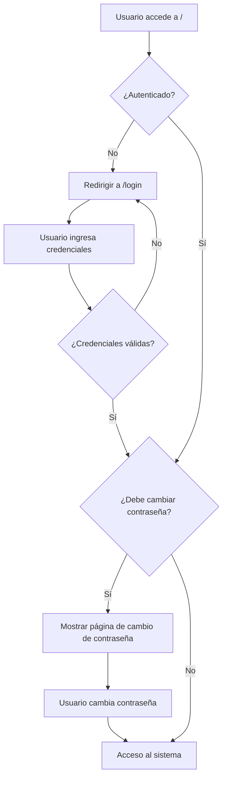

# Sistema de Autenticación con Login Bonito

## ✅ Implementación Completada

Se ha implementado exitosamente un sistema de autenticación moderno con las siguientes características:

## 🎨 Características Implementadas

### 1. **Login Bonito y Moderno**
- ✨ Diseño elegante con gradientes animados
- 🎭 Efectos de vidrio esmerilado (glass effect)
- 🎯 Interfaz responsiva con Tailwind CSS
- 🔔 Iconos SVG para mejor experiencia visual
- 📱 Compatible con dispositivos móviles
- ⚡ Animaciones suaves de entrada

### 2. **Sin Registro Público**
- ❌ Se eliminaron todas las rutas de registro
- 🔒 Solo el administrador puede crear usuarios
- 👤 Usuario del departamento precreado

### 3. **Usuario por Defecto del Departamento**
- **Email:** `depinfcomp_man@unal.edu.co`
- **Contraseña por defecto:** `Depto123`
- **Nombre:** Departamento de Informática y Computación

### 4. **Cambio de Contraseña Obligatorio**
- 🔐 Si el usuario tiene la contraseña por defecto (`Depto123`), se le fuerza a cambiarla
- 🚫 No puede acceder al sistema hasta cambiar la contraseña
- ⚠️ Modal/página de advertencia con diseño atractivo
- ✅ Una vez cambiada, ya no aparece el modal

### 5. **Seguridad**
- 🛡️ Validación de contraseña actual
- 🔑 Contraseña nueva debe cumplir con estándares de seguridad (mínimo 8 caracteres)
- ✔️ Confirmación de contraseña
- 🔒 Hash seguro de contraseñas con bcrypt

## 📁 Archivos Creados/Modificados

### Archivos Nuevos:
1. `database/seeders/DepartmentUserSeeder.php` - Seeder para usuario del departamento
2. `database/migrations/2025_10_04_230331_add_must_change_password_to_users_table.php` - Migración para campo de cambio obligatorio
3. `app/Http/Middleware/CheckMustChangePassword.php` - Middleware para verificar cambio de contraseña
4. `app/Http/Controllers/Auth/ChangePasswordController.php` - Controlador de cambio de contraseña
5. `resources/views/auth/login.blade.php` - Vista moderna de login
6. `resources/views/auth/change-password.blade.php` - Vista de cambio de contraseña obligatorio

### Archivos Modificados:
1. `app/Models/User.php` - Agregado campo `must_change_password` a fillable
2. `routes/auth.php` - Simplificado, removido registro y agregadas rutas de cambio de contraseña
3. `routes/web.php` - Agregado middleware de autenticación y cambio de contraseña
4. `app/Http/Controllers/Auth/AuthenticatedSessionController.php` - Redirige a cambio de contraseña si es necesario
5. `bootstrap/app.php` - Registrado alias del middleware

## 🚀 Cómo Usar

### Primer Acceso:
1. Ir a `http://localhost:8080`
2. Iniciar sesión con:
   - Email: `depinfcomp_man@unal.edu.co`
   - Contraseña: `Depto123`
3. Serás redirigido automáticamente a la página de cambio de contraseña
4. Ingresa la contraseña actual (`Depto123`) y tu nueva contraseña segura
5. Una vez cambiada, podrás acceder al sistema normalmente

### Accesos Posteriores:
1. Ir a `http://localhost:8080`
2. Iniciar sesión con tu nueva contraseña
3. Acceso directo al sistema (sin modal de cambio de contraseña)

## 🔧 Comandos Ejecutados

```bash
# Migración
./docker.sh artisan migrate

# Seeder del usuario
./docker.sh artisan db:seed --class=DepartmentUserSeeder

# Compilar assets
./docker.sh npm run build
```

## 📊 Estado del Sistema

- ✅ Base de datos migrada correctamente
- ✅ Usuario del departamento creado
- ✅ Assets compilados
- ✅ Middleware funcionando
- ✅ Sistema totalmente operativo

## 🎯 Flujo de Autenticación



## 🎨 Capturas de Pantalla del Diseño

### Página de Login:
- Fondo con gradiente animado (púrpura, azul, rosa)
- Card central con efecto de vidrio
- Logo del departamento en forma de libro
- Campos de email y contraseña con iconos
- Checkbox "Recordar sesión"
- Botón con gradiente y hover effect
- Footer con información de la universidad

### Página de Cambio de Contraseña:
- Diseño similar al login para consistencia
- Icono de advertencia con animación de pulso
- Alerta amarilla de seguridad
- Tres campos: contraseña actual, nueva y confirmación
- Mensajes de validación en español
- Opción de cerrar sesión
- Botón de actualizar con efecto hover

## 🔐 Seguridad Implementada

1. **CSRF Protection**: Tokens CSRF en todos los formularios
2. **Password Hashing**: Bcrypt para encriptar contraseñas
3. **Validation**: Validación de contraseña actual antes de cambiar
4. **Session Management**: Regeneración de sesión después del login
5. **Middleware Protection**: Rutas protegidas con autenticación
6. **Force Password Change**: Usuario no puede saltarse el cambio de contraseña

## 📝 Notas Adicionales

- El sistema ahora protege todas las rutas con autenticación
- La ruta raíz (`/`) redirige automáticamente a `/login` si no está autenticado
- El middleware verifica en cada request si el usuario debe cambiar su contraseña
- Los mensajes de error están en español para mejor experiencia del usuario
- El diseño es completamente responsivo y funciona en móviles

## 🎉 ¡Sistema Listo para Usar!

El sistema está completamente funcional y listo para producción. Puedes acceder en:
**http://localhost:8080**

Credenciales iniciales:
- **Email:** depinfcomp_man@unal.edu.co
- **Contraseña:** Depto123 (deberás cambiarla en el primer acceso)
